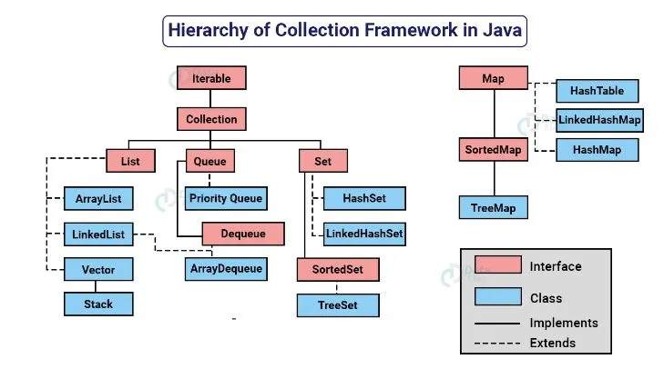

# Contents
1. Introduction
2. List 
3. Set
4. ArrayDeque
5. Map 
6. Collection common algorithms

## 1. Introduction

- Collection framework provides us built in data structures and algorithms which we as a developer can directly work.
- All classes and interfaces is present in java.util package.

## 2. List interface 
- It is an interface.
- 4 classes implement this interface(ArrayList, LinkedList, Vector, Stack).

### 2.a ArrayList class 
1. ArrayList provides us similar functionalities as of arrays, but it provides an advantage over arrays that is dynamic in nature, means in array, we are not able to add extra items once array is created, But in ArrayList we can add as many items as we want. So, it's size is not fixed.

2. null values can be inserted.
3. keys are unordered in map. Java doesnot gurantee any order.

3. Constructors
    ```java 
        // Constructs an empty list with an initial capacity of ten(default).
        ArrayList<T> list = new ArrayList();
                
        // Constructs a list containing the elements of the specified collection.
        ArrayList<T> list = new ArrayList(Collection<T> collection);
    ```

4. Methods to work with 
   ```java 
        // Read element at index i 
        T element = list.get(i);

        // Update the element at index i 
        list.set(i, newElement);

        // get total number of elements 
        int size = list.size();

        // add in the end of list, status returned is true if element added succesfully else return false.
        boolean status = list.add(element);

        // add at at index i 
         list.add(i, element);

        // remove element at index i, also return the removed elements.
        T element = list.remove(i);

        // search for first index and last of an element, return -1 if element not found.
        int firstIndex = list.indexOf(element);
        int lastIndex = list.lastIndexOf(element);

        // search if it contains an element or not, not interested in index only interested in present or not. ans is true if present
        boolean ans = list.contains(ele);

        // sort the entire list 
        list.sort();

        // traverse the arraylist , using typical for-i loop 
        for(int i=0;i=n;i<list.size()){
            int ele = list.get(i);
        }

        // traverse using enhanced for loop 
        for(int ele: arr){
            
        }
    ```
## Map
- It is an interface in java collection framework.
- Classes which implement this interface are HashMap, LinkedHashMap, TreeMap.

### 5.a HashMap
- It is a class which implements Map interface.
- It contains the data in key-value pair. {key1:val1, key2:val2, ...} 
- Keys can not be duplicates.
- Constructors:
    ```java 
    // Default constructor 
    HashMap<K,V> map = new HashMap<>();

    // Create HashMap with initial capacity
    HashMap<K,V> map = new HashMap<>();

    // Create HashMap which contains data of a another HashMap
    HashMap<K,V> map = new HashMap<>(anotherHashMap);
    ```
- Methods:
    ```java 
    // add 
    map.put(kay,value);

    // get value from key, returns null if key not present.
    V value = map.get(key);

    // returns the value if key is present else return the default value spcefied.
    V value = map.getOrDefault(key, defaultValue);

    // check if key is present or not 
    boolean status = map.containsKey(key);

    // remove an entry if keys is present else return null.
    V value = map.remove(key);

    // size of map 
    int size = map.size();

    // check if map is empty 
    boolean isEmtpty = map.isEmtpty();

    // traverse map using keyset
    for(K key: map.keySet()){
        V value = map.get(key);

        // Now do whatever you want to do, you have key:value both
    }
    ```
    