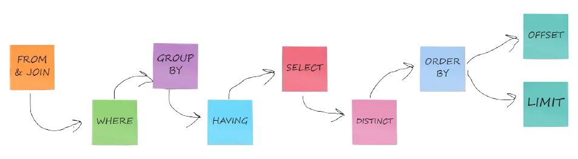

# Contents 
1. About 
2. SELECT FROM WHERE queries
3. Writing WHERE clause predicates 
4. Alias and subqueries
5. Set Operations 
6. Switch Case 
7. GROUP BY and HAVING
8. Joins 

## 1. About
- Data Query Language, provides query to fetch data from tables.
- Below Diagram illustrates which steps are taken first when query is processed:


## 2. SELECT FROM WHERE queries 
```sql
/* Fetch columns based on where predicate (can be ommited) */
SELECT col1, col2, ...,coln
FROM table1, table2, table3
WHERE predicate;

/* Distinct is used to select only Distinct record in resulting set */
SELECT DISTINCT col1, col2 
FROM tabl1 
WHERE predicate;

/* ORDER BY is used to sort the result set, Ascending order is default */
SELECT ..
FROM ...
WHERE ...
ORDER BY col1, col2 DESC;

/*LIMIT is used to limit the number of record in result */
SELECT ...
FROM ...
WHERE ...
LIMIT number_of_rows OFFSET number_of_rows_toskip;
```

## 3. Writing WHERE clause predicates 
```sql
-- only select the row whoose col1 column's value equal to val1.
WHERE col1=val1;  

-- can combine the multiple predicates using `AND, OR, NOT` logical operator. 
WHERE col1=val1 AND col2>val2; 

-- select the row if it's col1 column value equal to one of val1 or val2 or val3.
WHERE col1 IN (val1, val2, val3); 

-- select the row if it's col1 column value not equal to val1 or val2 or val3.
WHERE col1 NOT IN (val1, val2, val3); 

/* 
    Like operator is used to filter the record based on regex.
    select the record if it's column named col1's value matches with regex given 
*/
WHERE col1 LIKE 'regex';

/* 
    For each row, inner query will run.
    inner query must return a result set containing only one column.
    select the row if it's col1 column value is present in the table returned from the inner select from where query.
*/
WHERE col1 in (another select from where query);

/* 
    For each row the inner select from where query will run.
    if the size of result set returned by the inner query is not 0 then this  row is selected
*/
WHERE EXISTS(another select from where query);
```

## 4. Alias and subqueries
- `AS` keyword is used to create alias in sql.
- Alias are used to give the another name of a column or table. Needed when we are writing query to fetch record from 2 tables which have some columns with same name.
- subqueries(also called as nested queries) is a select-from-where query which is present inside another select-from-where query.
- Basically in our sql syntax, whereever we are expecting a table, we can write a subquery in place of that. the result of the subquery will be table we are looking for.
```sql
-- Creating alias for columns and tables using AS operator 
SELECT col1 AS new_name, table_new.col2 
FROM table1, table2 AS table2_new 
WHERE conditions;

-- Creating a subquery in from clause 
SELECT ...
FROM t1, (select-from-where subquery) t2 
WHERE ...
```

## 5. Set Operations 
```sql 
-- Mathematical union of 2 result set
(SELECT query1) UNION (SELECT query2);

-- Mathematical intersection of 2 result set.
(SELECT query1) INTERSECT (SELECT query2);

-- Mathematical substraction of 2 set 
(SELECT query1) MINUS (SELECT query2);

```
## 6. CASE-END 
```sql
/*  CASE END runs for every records  once and return first value which evaluates to true.
    can be used any where a single value is expected each record wise(in select clause or in where clause etc)
*/
    
CASE
    WHEN condition THEN result1
    WHEN condition THEN result2
    ..
    ELSE final_result
END
```
## 7. GROUP BY and HAVING
- `GROUP BY` is used to group multiple records of result set of `SELECT FROM WHERE` query based on column values.
- After grouping, we can fetch the stats of each group.
- `HAVING` clause is used to filter the groups in similar way, `WHERE` is used to filter records in `SELECT FROM WHERE`.
- Flow:
    1. SELECT-FROM-WHERE Query is executed and a result set is formed.
    2. Records of this result set is grouped based on column specified in `GROUP`.
    3. Groups are then filtered based on condition specified in `HAVING` clause.
- In SELECT, we can only write sql functions which gives aggregated result for each group or column used in grouping. 
- Examples
```sql 
-- Genral syntax, remember HAVING clause is optional.
SELECT ...
FROM ...
WHERE ..
GROUP BY col1,col2,..
HAVING <predicate>;

-- Aggregation Function
COUNT(*)
MIN(column)
MAX(column)
SUM(column)
AVG(column)
```
## 8. JOINS
- JOINs in sql are used to fetch record from 2 or more tables.

### 8.1 Join type:
1. `INNER JOIN or JOIN` 
    - It returns rows from 2 tables which passes the join conditions.

2. `LEFT JOIN or LEFT OUTER JOIN`
    - A left join returns all the rows from the left table, and the matched rows from the right table. 
    - If there is a record in the left table for which there is no record matched in the right table then for this record in the result set, all column of right table will be null.

3. `RIGHT JOIN or RIGHT OUTER JOIN`
    - A right join returns all the rows from the right table, and the matched rows from the left table. 
    - If there is a record in the right table for which there is no record matched in the left table then for this record in the result set, all column of left table will be null.

4. `FULL JOIN or FULL OUTER JOIN`
    - A full join returns all the rows from the both table which passes the join conditions. 
    - Also it includes all record from left table which does not match with any record in right table on join condition. For all the records of this type, populates null value for right table columns. 
    - Similiearly, includes all record from right table which does not matches with any records from left table and populate null values on left table columns for this kind of record.

5. `CROSS JOIN`
    - returns cartesian product of 2 tables
    - simple select from query without where or inner join with join conditions always evaluates true

### 8.3 Join Conditions:
1. `ON <where clause predicates>`
    - applies on every kind of join type
    - select all records after both tables are cross joined which passes this predicate.

2. `USING (column1, column2,..)`
    - if both tables have column with same name and data type, it will apply equal predicates on specified columns like t1.column1=t2.column1 

3. `NATURAL join`
    - it is a join operation which implicitly create a join condition that common columns in both table should have equal 
    values.
    - applies on inner join, left join, right join
    - returns result set, <common columns><left table remaining columns><rigt table remaining columns>
    - table1 natural join tabl2 or table1 natural left join tabl2;

### 8.4 sample join queries 
```sql
-- sample join queries syntax 
SELECT table1.col1, table2.col2
FROM table1 <join_type> tabl2 <join condition>
WHERE predicate;

-- natural join query 
SELECT *
FROM tabl1 NATURAL JOIN table2;

-- left outer join query 
SELECT *
FROM tabl1 LEFT OUTER JOIN table2;  -- we can omit the term OUTER and can write only LEFT JOIN.

-- right outer join query 
SELECT *
FROM tabl1 RIGHT  JOIN table2;

-- full outer join query 
SELECT *
FROM tabl1 FULL JOIN table2;
```